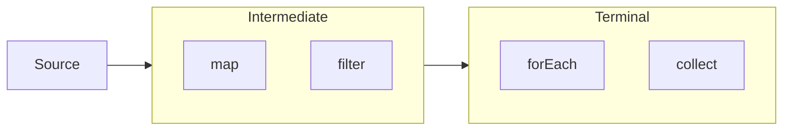

# 🚀 Stream Api





## Overview

- **Purpose:** Stream API facilitates functional-style operations on sequences of elements (like collections) and supports parallel processing.

## Core Concepts

- **Stream:** A sequence of elements supporting sequential and parallel aggregate operations.
- **Source:** The origin of a stream, such as a `Collection`, an array, or a generator function.
- **Intermediate Operations:** Transformations on streams that are lazy (e.g., `map`, `filter`). They return a new stream.
- **Terminal Operations:** Operations that produce a result or side-effect (e.g., `collect`, `forEach`). They trigger the processing of the stream.

> 💡 Chaining operations like `map` and `filter` is optimized to be done in one loop


## Key Operations

- **Creation:**
	- `Stream.of(T... values)`: Create a stream from values.
	- `Collection.stream()`: Create a stream from a collection.
	- `Arrays.stream(T[] array)`: Create a stream from an array.
	- `Stream.generate(Supplier<T> s)`: Create an infinite stream using a supplier.
	- `Stream.iterate(T seed, UnaryOperator<T> f)`: Create an infinite stream using an initial value and a function.
- **Intermediate Operations:**
	- `map(Function<T, R> mapper)`: Transforms each element into another form.
	- `filter(Predicate<T> predicate)`: Selects elements based on a condition.
	- `flatMap(Function<T, Stream<R>> mapper)`: Flattens nested streams into a single stream.
	- `distinct()`: Removes duplicate elements.
	- `sorted()`: Sorts elements in natural order or using a comparator.
	- `peek(Consumer<T> action)`: Allows examining elements as they are processed (used for debugging).
- **Terminal Operations:**
	- `collect(Collector<T, A, R> collector)`: Accumulates elements into a collection or other results.
	- `forEach(Consumer<T> action)`: Performs an action for each element.
	- `reduce(T identity, BinaryOperator<T> accumulator)`: Reduces elements to a single value using an accumulator.
	- `count()`: Counts the number of elements.
	- `anyMatch(Predicate<T> predicate)`: Checks if any elements match a predicate.
	- `allMatch(Predicate<T> predicate)`: Checks if all elements match a predicate.
	- `noneMatch(Predicate<T> predicate)`: Checks if no elements match a predicate.
	- `findFirst()`: Retrieves the first element in the stream.
	- `findAny()`: Retrieves any element (useful for parallel streams).
- **Parallel Streams:**
	- `parallelStream()`: Create a parallel stream from a collection.
	- Benefits: Can improve performance by leveraging multi-core processors for processing large data sets.
	- Considerations: Parallelism adds overhead and may not always lead to performance gains. It’s beneficial for large datasets or complex computations.

## Best Practices

- **Use Streams for Read-Only Operations:** Streams should generally be used for read-only operations to avoid side effects.
- **Avoid Statefulness in Lambda Expressions:** Stateful lambda expressions (those that maintain state between invocations) can lead to unpredictable results, especially in parallel streams.
- **Prefer Built-in Collectors:** Use standard collectors like `Collectors.toList()`, `Collectors.toSet()`, and `Collectors.joining()` to accumulate results efficiently.

## Example


```java
List<String> names = Arrays.asList("John", "Jane", "Jack", "Jill");

// Example of intermediate operations
List<String> filteredNames = names.stream()
    .filter(name -> name.startsWith("J"))
    .sorted()
    .collect(Collectors.toList());

// Example of terminal operations
long count = names.stream().count();

```

