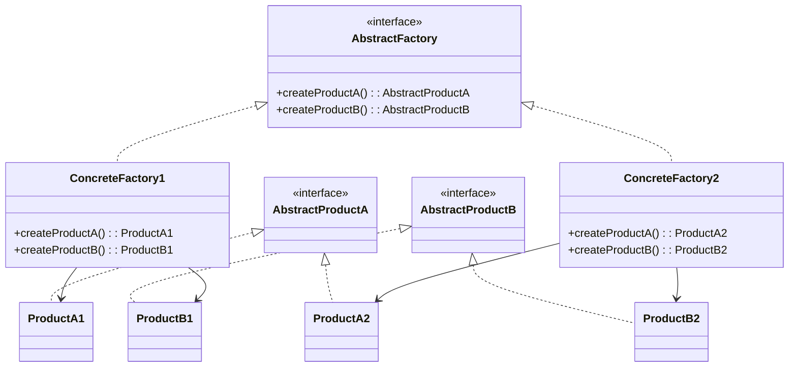

### Purpose

- Provide an interface that delegates creation calls to one or more concrete classes in order to deliver specific objects.

### Use when

- The creation of objects should be independent of the system utilizing them.
- Systems should be capable of using multiple families of objects.
- Families of objects must be used together.
- Libraries must be published without exposing implementation details.
- Concrete classes should be decoupled from clients.

### Example

Email editors allow for editing in multiple formats, including plain text, rich text, and HTML. Depending on the format, different objects are required: for plain text, a body object represents the text, and an attachment object encrypts attachments into Base64. For HTML, the body object represents HTML-encoded text, and the attachment object enables both inline representation and standard attachments. By using an abstract factory for creation, we ensure that the appropriate object sets are generated based on the email style being sent.

