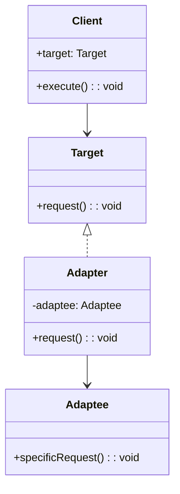

# 🚀 Adapter Pattern

### Purpose

- The Adapter Pattern is a structural design pattern that allows incompatible interfaces to work together. It acts as a bridge between two objects, converting the interface of a class into another interface that a client expects. This pattern is particularly useful when integrating existing components that are incompatible with the rest of the system.

### Use when

- When you have existing classes or systems with interfaces that are not directly compatible with the interface your client code expects.
- When you need to integrate legacy systems or third-party libraries into your application.
- To reuse existing functionality without modifying the original code.

### Example

A billing application needs to interface with an HR application in order to exchange employee data, however each has its own interface and implementation for the Employee object. In addition, the SSN is stored in different formats by each system. By creating an adapter, we can create a common interface between the two applications that allows them to communicate using their native objects and is able to transform the SSN format in the process.

