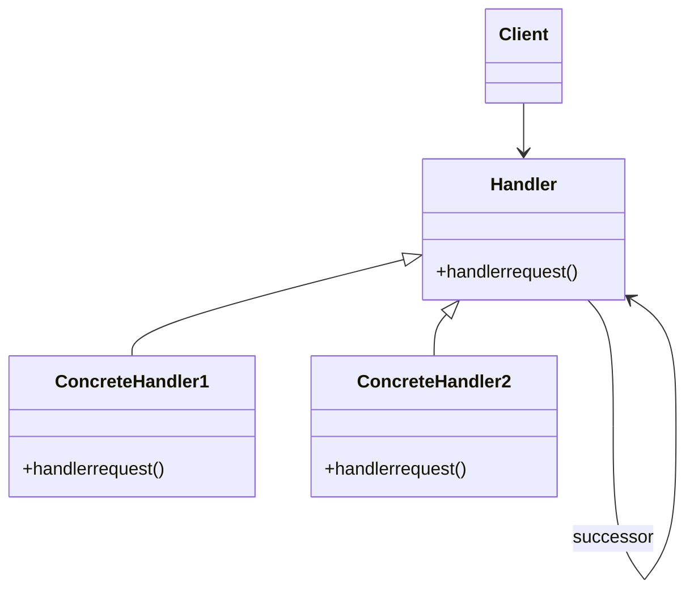

# 🚀 Chain of Responsibility Pattern

### Purpose

- The Chain of Responsibility Pattern allows passing a request along a chain of handlers. Each handler in the chain either processes the request or passes it along to the next handler. It decouples the sender of a request from its receivers by allowing multiple objects to handle the request.

### Use when

- You have a set of handlers where each handler can process a request or pass it to the next handler in the chain.
- You want to avoid coupling the sender of a request to its receiver.
- You want to add or change handlers dynamically.

### Example

Exception handling in some languages implements this pattern. When an exception is thrown in a method the runtime checks to see if the method has a mechanism to handle the exception or if it should be passed up the call stack. When passed up the call stack the process repeats until code to handle the exception is encountered or until there are no more parent objects to hand the request to.

