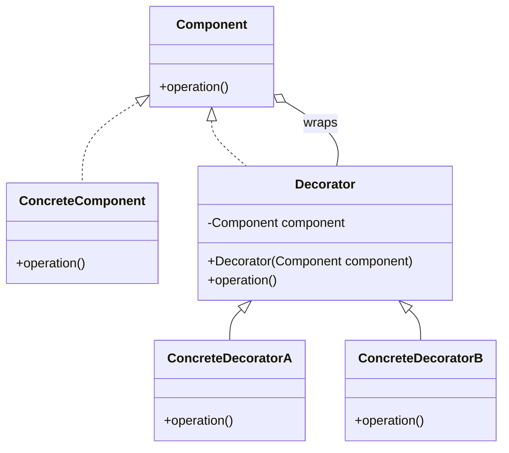

# Decorator Pattern

### Purpose

- The Decorator Pattern is a structural design pattern that allows you to dynamically add behavior or responsibilities to objects without modifying their code. It’s an alternative to subclassing, where new functionality is added by wrapping an object within another object.
- It uses composition instead of inheritance.

### Use when

- To extend the functionality of an object without altering its structure.
- To add functionalities to a class without altering its original code, keeping the class focused on its primary responsibility.
- To compose behaviors in a flexible and reusable way by chaining decorators.
- Subclassing to achieve modification is impractical or impossible.
- A lot of little objects surrounding a concrete implementation is acceptable.

### Example

Many businesses set up their mail systems to take advantage of decorators. When messages are sent from someone in the company to an external address the mail server decorates the original message with copyright and confidentiality information. As long as the message remains internal the information is not attached. This decoration allows the message itself to remain unchanged until a runtime decision is made to wrap the message with additional information.

