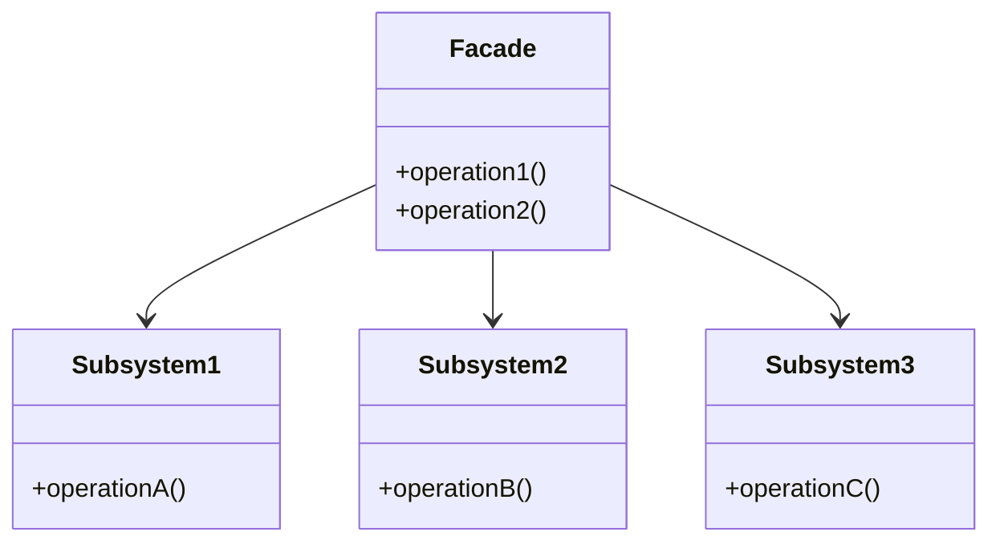

### Purpose

- The Facade Pattern is a design pattern in software development that simplifies the interface for interacting with a complex system.
- Think of it as a “front desk” for a hotel. When you visit a hotel, you don’t directly interact with the cleaning staff, kitchen, or maintenance workers. Instead, you go to the front desk, and the front desk handles everything for you. The front desk is your simple, easy-to-use interface to the hotel.

### Use when

- A simple interface is needed to provide access to a complex system.
- There are many dependencies between system implementations and clients.
- Systems and subsystems should be layered.

### Example

By exposing a set of functionalities through a web service the client code needs to only worry about the simple interface being exposed to them and not the complex relationships that may or may not exist behind the web service layer. A single web service call to update a system with new data may actually involve communication with a number of databases and systems, however this detail is hidden due to the implementation of the facade pattern.

