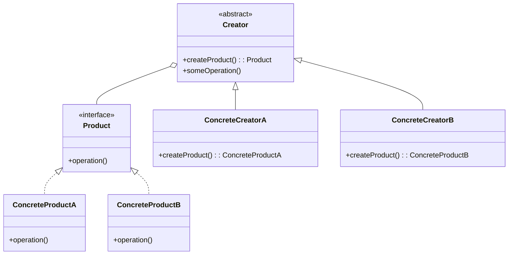

# Factory Pattern

### Purpose

- Factory design pattern is a creational design pattern that provides an interface for creating objects in a superclass but allows subclasses to alter the type of objects that will be created.
- Exposes a method for creating objects, allowing subclasses to control the actual creation process.

### Use when

- A class will not know what classes it will be required to create.
- Subclasses may specify what objects should be created.
- Parent classes wish to defer creation to their subclasses.
- Useful for frequent code changes

### Example

Many applications have some form of user and group structure for security. When the application needs to create a user it will typically delegate the creation of the user to multiple user implementations. The parent user object will handle most operations for each user but the subclasses will define the factory method that handles the distinctions in the creation of each type of user. A system may have AdminUser and StandardUser objects each of which extend the User object. The AdminUser object may perform some extra tasks to ensure access while the StandardUser may do the same to limit access.

