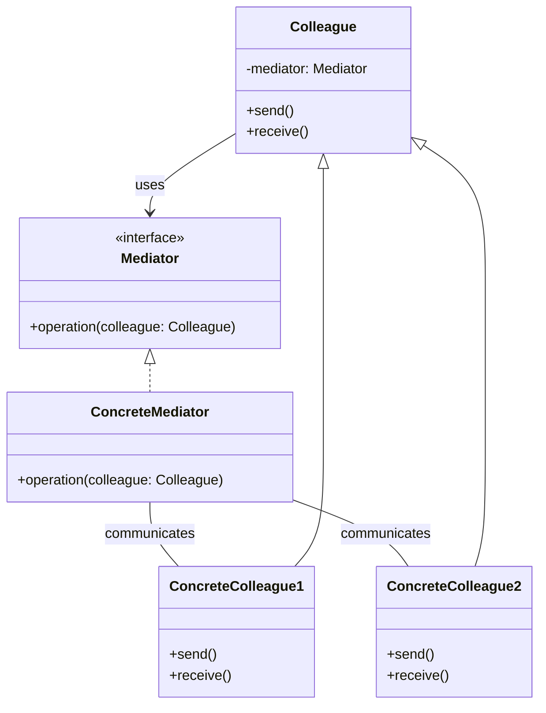

# Mediator Pattern

### Purpose

- The Mediator Pattern is a behavioral design pattern that helps reduce the complexity of communication between multiple objects or components. It does this by introducing a mediator object that handles all interactions between the different objects, so they don’t have to communicate with each other directly.

### Use when

- Without a mediator, each object would need to know about and communicate with every other object. This can get complex and hard to manage as the number of objects grows.
- Objects (colleagues) need to be decoupled from one another, meaning they don’t need to be aware of each other. They only interact with the mediator, making the system easier to maintain and extend.

### Example

Mailing list software keeps track of who is signed up to the mailing list and provides a single point of access through which any one person can communicate with the entire list. Without a mediator implementation a person wanting to send a message tothe group would have to constantly keep track of who was signed up and who was not. By implementing the mediator pattern the system is able to receive messages from any point then determine which recipients to forward the message on to, without the sender of the message having to be concerned with the actual recipient list.

