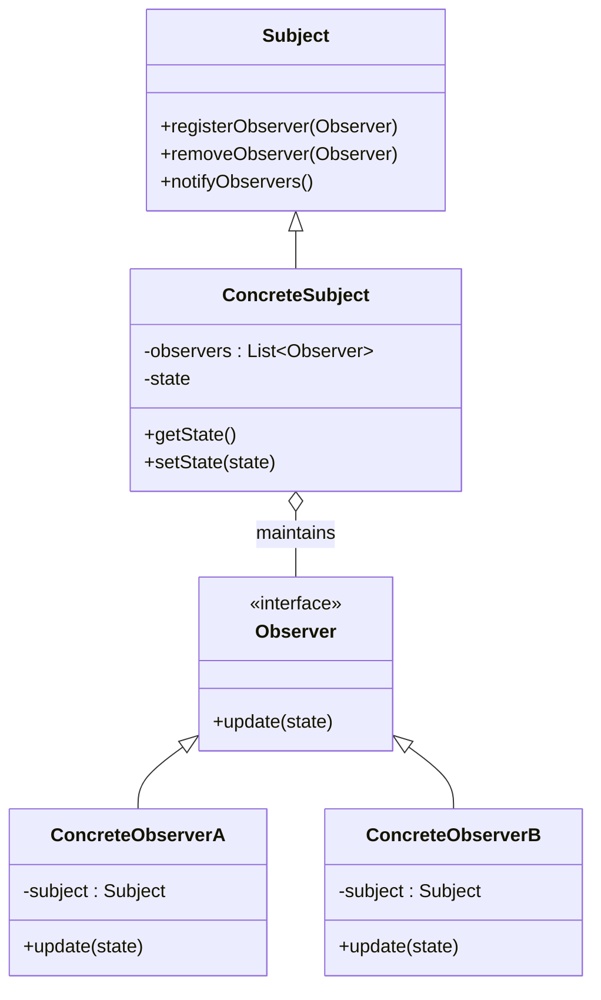

# 🚀 Observer Pattern

### Purpose

- The Observer Pattern is a behavioral design pattern that defines a one-to-many dependency between objects so that when one object changes state, all its dependents are notified and updated automatically.
- This pattern is essential for creating systems where multiple objects need to be informed about changes in another object without tightly coupling them.

### Use when

- State changes in one or more objects should trigger behavior in other objects
- Broadcasting capabilities are required.
- An understanding exists that objects will be blind to the expense of notification.

### Example

- Event Handling Systems: When an object needs to notify other objects without making assumptions about who these objects are.
- Distributed Event Systems: When changes in one part of an application need to be propagated to other parts.
- This pattern can be found in almost every GUI environment. When buttons, text, and other fields are placed in applications the application typically registers as a listener for those controls. When a user triggers an event, such as clicking a button, the control iterates through its registered observers and sends a notification to each.
