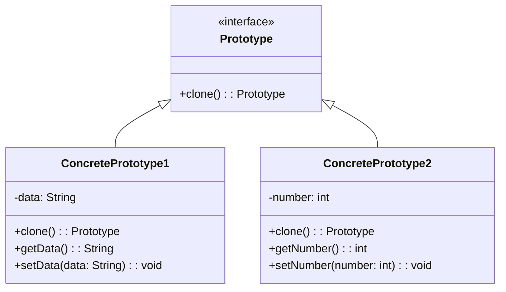

# Prototype Pattern

### Purpose

- The Prototype Pattern is a creational design pattern used to create new objects by copying an existing object, known as the prototype. This pattern is particularly useful when the cost of creating a new object from scratch is more expensive than copying an existing object. It allows for the creation of new instances based on an existing instance, which can be more efficient.

### Use when

- Creating complex objects with many attributes and dependencies can be expensive and time-consuming.
- Some objects might need to be configured or initialized in a certain way, and copying an existing object can be more straightforward than reconfiguring it from scratch.

### Example

Rates processing engines often require the lookup of many different configuration values, making the initialization of the engine a relatively expensive process. When multiple instances of the engine are needed, say for importing data in a multi-threaded manner, the expense of initializing many engines is high. By utilizing the prototype pattern, we can ensure that only a single copy of the engine has to be initialized then simply clone the engine to create a duplicate of the already initialized object. The added benefit of this is that the clones can be streamlined to only include relevant data for their situation.

