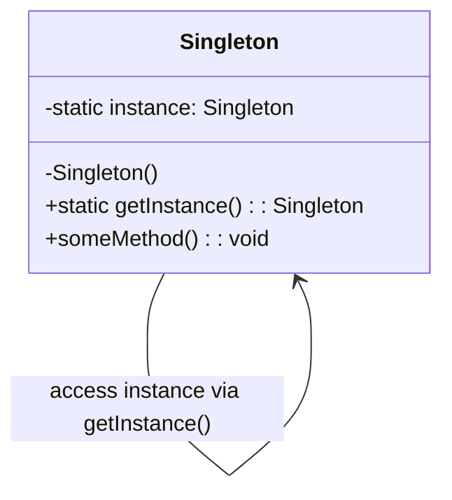

# Singleton Pattern

### Purpose

- Singleton is a creational design pattern that lets you ensure that a class has only one instance, while providing a global access point to this instance.

### Use when

- Exactly one instance of a class is required.
- Controlled access to a single object is necessary.

### Example

Most languages provide some sort of system or environment object that allows the language to interact with the native operating system. Since the application is physically running on only one operating system there is only ever a need for a single instance of this system object. The singleton pattern would be implemented by the language runtime to ensure that only a single copy of the system object is created and to ensure only appropriate processes are allowed access to it.

**Database Connections**: Only one instance of a connection should be used to manage interactions with the database.

**Logging****:** A single instance of a logger can be used to ensure that all parts of an application log information to the same place.

**Configuration Management:** A single instance can manage the configuration settings of an application.

