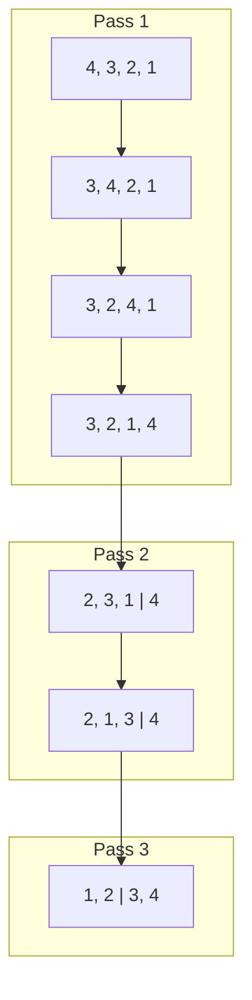
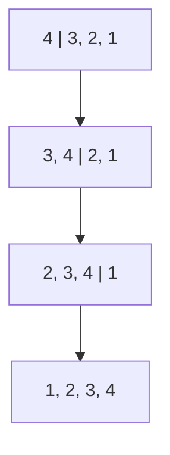
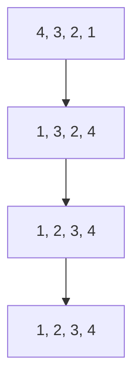
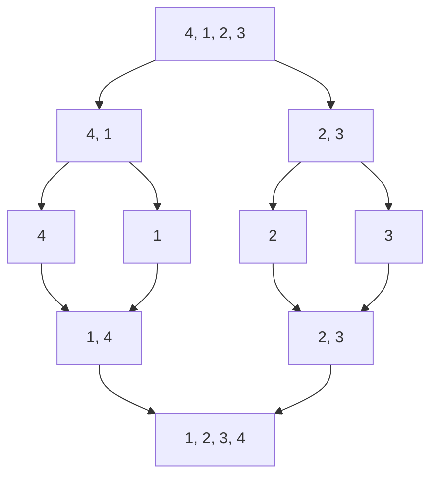
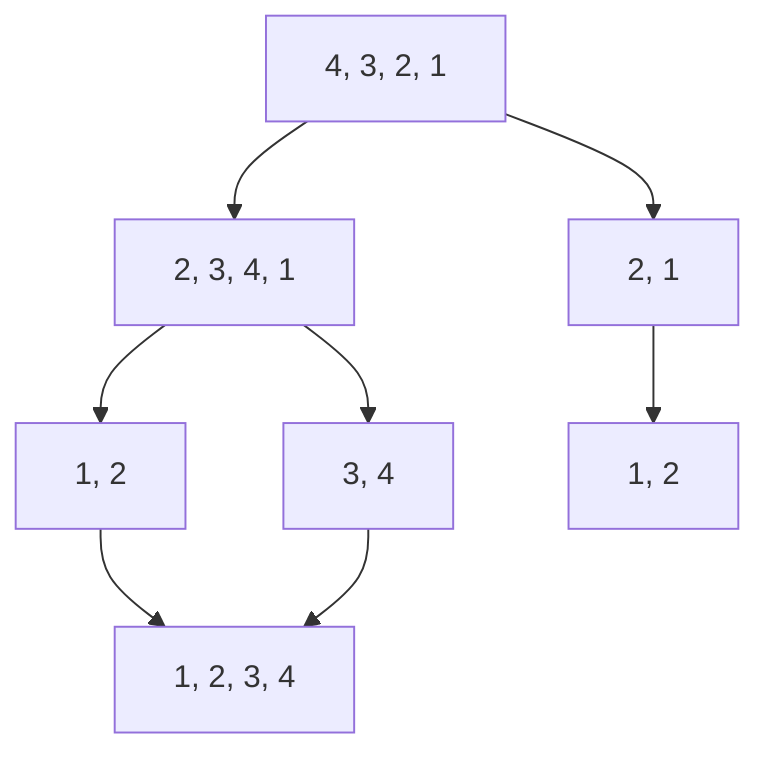

# 🚀 Sorting Algorithms

[https://youtube.com/playlist?list=PL7hO-vBQK3K0_bgivFB4mZsjLdKdJ_DEm&feature=shared](https://youtube.com/playlist?list=PL7hO-vBQK3K0_bgivFB4mZsjLdKdJ_DEm&feature=shared)

[Course: Mastering Data Structures & Algorithms using C and C++ | Udemy Business](https://tredence.udemy.com/course/datastructurescncpp/learn/lecture/13190984#overview)

---

## ⌛ Time Complexities

| **Algorithm**      | **Worst Case** | **Average Case** | **Best Case** |
| ------------------ | -------------- | ---------------- | ------------- |
| **Bubble Sort**    | O(n²)          | O(n²)            | O(n)          |
| **Insertion Sort** | O(n²)          | O(n²)            | O(n)          |
| **Selection Sort** | O(n²)          | O(n²)            | O(n²)         |
| **Merge Sort**     | O(n log n)     | O(n log n)       | O(n log n)    |
| **Quick Sort**     | O(n²)          | O(n log n)       | O(n log n)    |

> 💡 **Java 7 through Java 22 uses** _**Dual-Pivot Quicksort**_ **for primitives and** _**TimSort**_ **for objects.**

---

## 🚀 Bubble Sort

Bubble Sort is a simple comparison-based algorithm. It repeatedly steps through the list, compares adjacent elements, and swaps them if they are in the wrong order. This process is repeated until the list is sorted.

### Steps:

1. Start from the first element.
2. Compare the current element with the next element.
3. If the current element is greater than the next element, swap them.
4. Move to the next element and repeat the process until the end of the list.
5. Repeat the above steps for all elements except the last one, which is already in its correct position after the first pass.
6. Continue this process until no swaps are needed.

### Diagram:

---

## 🚀 Insertion Sort

Insertion Sort builds the sorted array one item at a time. It picks an element and inserts it into its correct position within the sorted portion of the array.

### Steps:

1. Assume the first element is already sorted.
2. Pick the next element and compare it with the elements in the sorted portion.
3. Shift all elements in the sorted portion that are greater than the picked element one position to the right.
4. Insert the picked element into its correct position.
5. Repeat until the entire array is sorted.

### Diagram:

---

## 🚀 Selection Sort

Selection Sort divides the array into two parts: a sorted subarray and an unsorted subarray. It repeatedly selects the smallest (or largest) element from the unsorted subarray and swaps it with the first element of the unsorted part.

### Steps:

1. Start with the entire array as unsorted.
2. Find the smallest element in the unsorted part.
3. Swap it with the first unsorted element.
4. Move the boundary between the sorted and unsorted subarrays one element to the right.
5. Repeat until the entire array is sorted.

### Diagram:

---

## 🚀 Merge Sort

Merge Sort is a divide-and-conquer algorithm. It divides the array into two halves, recursively sorts each half, and then merges the two sorted halves.

### Steps:

1. Divide the array into two halves.
2. Recursively sort each half.
3. Merge the two sorted halves into a single sorted array.

### Diagram:

### Steps to Calculate Time Complexity: 

1. **Divide**:
    - The algorithm recursively divides the array into two halves until each subarray contains a single element. This division step occurs `log₂(n)` times, where `n` is the number of elements in the array. The division process creates a binary tree of depth `log₂(n)`.
2. **Conquer** (Merge):
    - After dividing the array, Merge Sort combines (merges) the subarrays back together in sorted order. Each merge operation takes linear time, O(n), because it needs to go through all the elements to combine the sorted halves. Since each level of the tree involves merging all elements in the array once, the merge operation at each level is O(n).
3. **Combine**:
    - The combine step involves merging sorted subarrays at each level of the recursion tree. Since the merging happens at every level of the recursion, and there are `log₂(n)` levels, each involving O(n) work, the overall time complexity can be calculated as: `n * log₂(n)`

---

## 🚀 Quick Sort

Quick Sort is another divide-and-conquer algorithm. It picks a pivot element and partitions the array into two subarrays: elements less than the pivot and elements greater than the pivot. It then recursively sorts the subarrays.

### Steps:

1. Pick a pivot element.
2. Partition the array into two subarrays: one with elements less than the pivot and one with elements greater than the pivot.
3. Recursively sort the subarrays.
4. Combine the sorted subarrays and the pivot into a single sorted array.

### Diagram:

