# 🚀 Array Deque

- Implemented using a circular array
- When deque is full, the array is resized
- `head` and `tail` are pointers that point to the front and back of the deque, respectively.

```mermaid
graph LR
    subgraph CircularArray["Circular Array"]
        A1["7"] --> A2["21"]
        A2 --> A3["null"]
        A3 --> A4["null"]
        A4 --> A5["56"]
        A5 --> A6["74"]
    end

    H[Head Pointer] --> A2
    T[Tail Pointer] --> A5

    style A1 fill:#46571d
    style A2 fill:#46571d
    style A5 fill:#201d57
    style A6 fill:#201d57
```




## Code


```java
public class Deque<E> {
    int head;
    int tail;
    int capacity;
    E[] elements;

    @SuppressWarnings("unchecked")
    public Deque(int capacity) {
        this.capacity = capacity;
        head = 0;
        tail = -1;
        elements = (E[]) new Object[capacity];

    }

    @SuppressWarnings("unchecked")
    public void doubleCapacity() {
        int newCapacity = capacity * 2;
        E[] tempArr = (E[]) new Object[newCapacity];

        int newHead = (newCapacity - 1) - (capacity - 1 - head);
        System.arraycopy(elements, 0, tempArr, 0, tail);
        System.arraycopy(elements, tail + 1, tempArr, newHead, newCapacity-1-newHead);

        elements = tempArr;
        capacity = newCapacity;
        head = newHead;
    }

    public void insertFront(E value) {
        head = head - 1;
        if (head < 0) {
            head = head + capacity;
        }
        if (head == tail) doubleCapacity();
        elements[head] = value;
    }

    public void insertLast(E value) {
        tail = tail + 1;
        if (tail > capacity - 1) {
            tail = tail - capacity;
        }
        if (head == tail) doubleCapacity();
        elements[tail] = value;
    }

    public E removeFront() {
        E temp = elements[head];
        elements[head] = null;
        head++;
        if (head > capacity-1) {
            head = head - capacity;
        }
        return temp;
    }

    public E removeLast() {
        E temp = elements[tail];
        elements[tail] = null;
        tail--;
        if (tail < 0) {
            tail = tail + capacity;
        }
        return temp;
    }

    public boolean isEmpty() {
        return head == tail;
    }

    public boolean isFull() {
        return (tail + 1) % capacity == head;
    }
}
```

