# 🚀 Binary Search Trees

- Must be a binary tree
- The elements to the left of a node should be smaller than it, and to the right of the node should be greater than it
- The number of nodes `n`in a complete binary tree with height `h` can be derived from the sum of a geometric series.

## 🚀 Height vs Nodes

```mermaid
graph LR
    A["$$n=2^0 + 2^1 + 2^2 + ... + 2^h$$"] --> B["$$n=\frac{2^{h+1} - 1}{2 - 1}$$"]
    B --> C["$$n=2^{h+1} - 1$$"]
    C --> D["$$h ≈ log(n)$$"]
```





## 🚀 Traversals


## 🚀 Steps to search element in BST

- use depth first search
- Time complexity will be `log(n)` since height is `log(n)`

## 🚀 Steps to add elements in a BST

- An element is always inserted at the tail node in a BST
- The process to find tail node and time complexity is similar to search
- If the value is already present, we don’t add the value

## 🚀 Steps to remove element from BST

- Traverse and find the element
- If it is a leaf node, set it to `null`; if it has one child, replace it with that child; if it has two children, replace it with the in-order successor and remove the successor
- Time complexity will be `log(n)`

## Code


```java
class TreeNode {
    public int value;
    public TreeNode left;
    public TreeNode right;

    public TreeNode(int value, TreeNode left, TreeNode right) {
        this.value = value;
        this.left = left;
        this.right = right;
    }
}

public class BinarySearchTree {
    private TreeNode root;

    public BinarySearchTree(int value) {
        this.root = new TreeNode(value, null, null);
    }

    public TreeNode searchFromNode(TreeNode node, int value) {
        if (node == null || node.value == value) return node;
        if (value < node.value) {
            return searchFromNode(node.left, value);
        } else {
            return searchFromNode(node.right, value);
        }
    }

    // Search take O(log n)
    public TreeNode search(int value) {
        return searchFromNode(root, value);
    }

    // Add similar to search, Node is always added to leaf node
    public void add(int value) {
        TreeNode rootNode = root;
        while (rootNode != null) {
            if (value < rootNode.value) {
                if (rootNode.left == null) {
                    rootNode.left = new TreeNode(value, null, null);
                }
                rootNode = rootNode.left;
            } else if (value > rootNode.value) {
                if (rootNode.right == null) {
                    rootNode.right = new TreeNode(value, null, null);
                }
                rootNode = rootNode.right;
            } else {
                return;
            }
        }
    }

    public TreeNode minNode(TreeNode node){
        if(node.left == null){
            return node;
        }
        return minNode(node.left);
    }
    public void removeFromNode(TreeNode node, int value) {
        if(node == null) return;
        if (value < node.value) {
            removeFromNode(node.left, value);
        } else if (value > node.value) {
            removeFromNode(node.right, value);
        } else {
            // found the value
            if (node.left == null && node.right == null) {
                node = null;
            } else if (node.left == null) {
                node = node.right;
            } else if (node.right == null) {
                node = node.left;
            } else {
                TreeNode minRightNode = minNode(node.right);
                removeFromNode(node.right, minRightNode.value);
                node = minRightNode;
            }
        }
    }

    public void remove(int value) {
        removeFromNode(root, value);
    }

}
```

