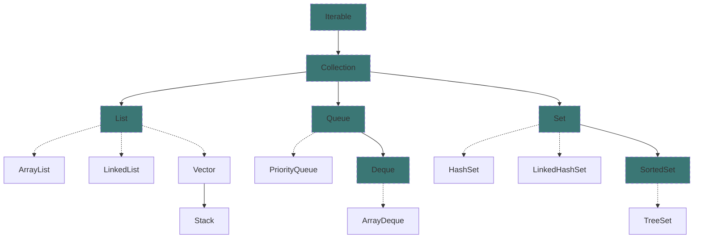
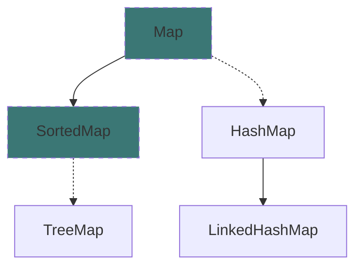

# 🚀 Collection Framework

# Important Classes

## `ArrayList` 

- Resizable array
- Fast random access
- Slower insertions/removals

## `LinkedList`

- Doubly linked list
- Efficient insertions/removals
- Poor random access
- Supports queue/stack operations

## `Vector`

- Synchronized resizable array
- Thread-safe
- Slower due to synchronization

## `Stack`

- LIFO stack
- Synchronized
- Provides `push`, `pop`, and `peek` operations

## `PriorityQueue`

- Queue with priority-based ordering
- O (log n) complexity for retrieval

## `ArrayDeque`

- Resizable array implementation of `deque`
- Supports FIFO and LIFO operations
- Generally faster than `linkedlist`

## `HashSet`

- Set with no duplicates
- No guaranteed order
- Fast performance due to hashing

## `LinkedHashSet`

- Maintains insertion order
- Predictable iteration order

## `TreeSet`

- Set with sorted elements
- Log(n) time complexity for operations

## `HashMap`

- Map with no guaranteed order
- Fast performance due to hashing

## `LinkedHashMap`

- Predictable iteration order
- Can maintain insertion or access order

## `TreeMap`

- Map with sorted keys
- Log(n) time complexity for operations

## `Hashtable`

- Synchronized map
- Thread-safe but with synchronization overhead

## `ConcurrentHashMap`

- Thread-safe map
- High concurrency support
- Better performance than `Hashtable`

## `EnumSet`

- Specialized set for Enum types
- Efficient and space-optimized

## `EnumMap`

- Specialized map for Enum keys
- Highly efficient

## `Collections` 

- Methods for sorting, searching, shuffling, and synchronizing collections

## `Iterator` 

- Methods: `hasNext()`, `next()`, `remove()`

## `Iterable`

- Allows iteration with `iterator()` method
- Used in enhanced for-loops

# Method References

### Methods Found in All Collections (Lists, Stacks, Queues, Sets, Maps)

- **`clear()`**: Removes all elements of the collection.
- **`equals(Collection)`**: Returns `true` if the given other collection contains the same elements.
- **`isEmpty()`**: Returns `true` if the collection has no elements.
- **`size()`**: Returns the number of elements in the collection.
- **`toString()`**: Returns a string representation like `"[10, -2, 43]"`.

### Methods Found in Both Lists and Sets (ArrayList, LinkedList, HashSet, TreeSet)

- **`add(Value)`**: Adds value to the collection (appends at the end of the list).
- **`contains(Value)`**: Returns `true` if the given value is found in this collection.
- **`remove(Value)`**: Finds and removes the given value from this collection.
- **`removeAll(Collection)`**: Removes any elements found in the given collection from this one.
- **`retainAll(Collection)`**: Removes any elements not found in the given collection from this one.

### List<E> Methods

- **`add(index, value)`**: Inserts given value at the specified index, shifting subsequent values right.
- **`indexOf(Value)`**: Returns the first index where the given value is found in the list (`1` if not found).
- **`get(index)`**: Returns the value at the specified index.
- **`lastIndexOf(Value)`**: Returns the last index where the given value is found in the list (`1` if not found).
- **`remove(index)`**: Removes and returns the value at the specified index, shifting subsequent values left.
- **`set(index, value)`**: Replaces the value at the specified index with the given value.
- **`subList(from, to)`**: Returns a sublist from index `from` (inclusive) to `to` (exclusive).

### Stack<E> Methods

- **`peek()`**: Returns the top value from the stack without removing it.
- **`pop()`**: Removes the top value from the stack and returns it.
- **`push(Value)`**: Places the given value on top of the stack.

### Queue<E> Methods

- **`add(value)`**: Places the given value at the back of the queue.
- **`peek()`**: Returns the front value from the queue without removing it; returns `null` if the queue is empty.
- **`remove()`**: Removes and returns the value from the front of the queue; throws `NoSuchElementException` if the queue is empty.

### Map<K, V> Methods

- **`containsKey(key)`**: Returns `true` if the map contains a mapping for the given key.
- **`get(key)`**: Returns the value mapped to the given key (`null` if none).
- **`keySet()`**: Returns a `Set` of all keys in the map.
- **`put(key, value)`**: Adds a mapping from the given key to the given value.
- **`putAll(map)`**: Adds all key/value pairs from the given map to this map.
- **`remove(key)`**: Removes any existing mapping for the given key.
- **`toString()`**: Returns a string such as `"{a=90, d=60, c=70}"`.
- **`values()`**: Returns a `Collection` of all values in the map.
