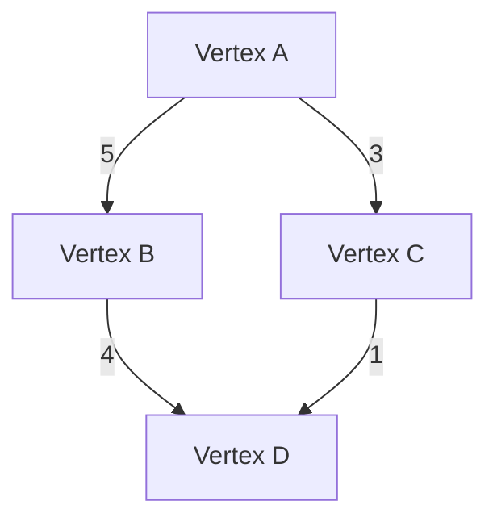
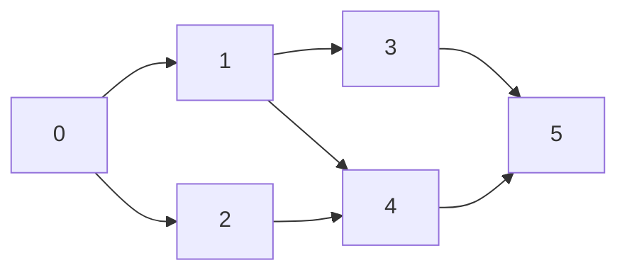

# 🚀 Graphs

- A graph is a collection of nodes (called vertices) and edges that connect pairs of vertices.
- Can represent many real-world structures like networks, social connections, and paths.
- **Directed Graph (Digraph)**: Edges have direction (A → B means A is connected to B but not vice versa).
- **Undirected Graph**: Edges do not have direction (A ↔ B means A and B are mutually connected).
- **Weighted Graph**: Edges have weights/costs (e.g., distances, costs, etc.).
- **Unweighted Graph**: Edges have no weights.

### Graph Representation

1. **Adjacency Matrix**:
    - A 2D matrix of size `V x V` (where V is the number of vertices).
    - Matrix[i][j] represents if there is an edge from vertex `i` to vertex `j` (1 or true if connected, 0 or false otherwise).
2. **Adjacency List**:
    - An array of lists. Each index represents a vertex, and each list contains all adjacent vertices.
    - More space-efficient than an adjacency matrix for sparse graphs.




## 🚀 Key Graph Operations


### Add Vertex

- Add a new node to the graph.
- For adjacency matrix, resize the matrix.
- For adjacency list, add a new list entry.

### Add Edge

- Connect two nodes by adding an edge between them.
- In an adjacency matrix, set `matrix[i][j] = 1`.
- In an adjacency list, add the destination node to the list of the source node.

### Depth First Search (DFS)

- Start at a node, visit all its neighbors before backtracking.
- Uses a stack (or recursive call stack).
- Time complexity: `O(V + E)` where V is vertices and E is edges.

### Breadth First Search (BFS)

- Start at a node and visit all its neighbors before visiting the neighbors’ neighbors.
- Uses a queue.
- Time complexity: `O(V + E)`.

## Code 


```java
import java.util.*;

public class Graph {
    private Map<Integer, List<Integer>> adjacencyList;
    private int vertices;

    public Graph(int vertices) {
        this.vertices = vertices;
        adjacencyList = new HashMap<>();
        for (int i = 0; i < vertices; i++) {
            adjacencyList.put(i, new ArrayList<>());
        }
    }

    // Add edge between two vertices (directed graph)
    public void addEdge(int source, int destination) {
        adjacencyList.get(source).add(destination);
    }

    // Add edge between two vertices (undirected graph)
    public void addUndirectedEdge(int source, int destination) {
        adjacencyList.get(source).add(destination);
        adjacencyList.get(destination).add(source);
    }

    // Print the graph
    public void printGraph() {
        for (int vertex : adjacencyList.keySet()) {
            System.out.print("Vertex " + vertex + ": ");
            for (int adjacent : adjacencyList.get(vertex)) {
                System.out.print(adjacent + " ");
            }
            System.out.println();
        }
    }

    // Depth First Search (DFS)
    public void DFS(int startVertex) {
        boolean[] visited = new boolean[vertices];
        DFSUtil(startVertex, visited);
    }

    private void DFSUtil(int vertex, boolean[] visited) {
        visited[vertex] = true;
        System.out.print(vertex + " ");

        for (int adjacent : adjacencyList.get(vertex)) {
            if (!visited[adjacent]) {
                DFSUtil(adjacent, visited);
            }
        }
    }

    // Breadth First Search (BFS)
    public void BFS(int startVertex) {
        boolean[] visited = new boolean[vertices];
        Queue<Integer> queue = new LinkedList<>();

        visited[startVertex] = true;
        queue.add(startVertex);

        while (!queue.isEmpty()) {
            int vertex = queue.poll();
            System.out.print(vertex + " ");

            for (int adjacent : adjacencyList.get(vertex)) {
                if (!visited[adjacent]) {
                    visited[adjacent] = true;
                    queue.add(adjacent);
                }
            }
        }
    }

    public static void main(String[] args) {
        Graph graph = new Graph(5);

        // Add edges
        graph.addEdge(0, 1);
        graph.addEdge(0, 4);
        graph.addEdge(1, 2);
        graph.addEdge(1, 3);
        graph.addEdge(1, 4);
        graph.addEdge(2, 3);
        graph.addEdge(3, 4);

        // Print graph
        System.out.println("Graph:");
        graph.printGraph();

        // Perform DFS
        System.out.println("\\nDFS starting from vertex 0:");
        graph.DFS(0);

        // Perform BFS
        System.out.println("\\n\\nBFS starting from vertex 0:");
        graph.BFS(0);
    }
}
```


### Time Complexity

- **DFS/BFS**: `O(V + E)` where V is the number of vertices and E is the number of edges.

### Space Complexity

- **Adjacency List**: `O(V + E)`



