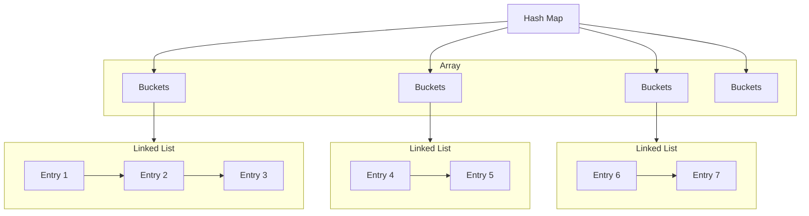

# 🚀 Hash Maps

- Use arrays to store buckets
- Inside buckets we have linked lists to avoid collision and store key value pair
- Resizing occurs when the number of entries exceeds a certain threshold, which involves rehashing and redistributing the entries
- Resizing is very costly as all keys need to be hashed again and put into new buckets
- If we know we are going to store many objects, we can set the initial size of Hash Map as large value to avoid resizing
- The objects to be used as keys should have a `hashCode()` method




## Code


```java
import java.util.LinkedList;

class KeyValuePair<K, V> {
    public K key;
    public V value;

    public KeyValuePair(K key, V value) {
        this.key = key;
        this.value = value;
    }
}

// TODO: Add resize based on factor
public class HashMap<K, V> {
    private int capacity;
    public int size;
    private final LinkedList<KeyValuePair<K, V>>[] buckets;

    public HashMap() {
        this.capacity = 16;
        this.size = 0;
        this.buckets = new LinkedList[capacity];
    }

    public HashMap(int capacity) {
        this.capacity = capacity;
        this.size = 0;
        this.buckets = new LinkedList[capacity];
    }

    public V get(K key) {
        if(key == null) return null;
        int keyHashValue = Math.abs(key.hashCode() % capacity);
        LinkedList<KeyValuePair<K, V>> bucket = buckets[keyHashValue];
        if (bucket == null) {
            return null;
        }
        for (KeyValuePair<K, V> elem : bucket) {
            if (elem.key.equals(key)) return elem.value;
        }
        return null;
    }

    public void set(K key, V value) {
        if(key == null) return;
        int keyHashValue = Math.abs(key.hashCode() % capacity);
        LinkedList<KeyValuePair<K, V>> bucket = buckets[keyHashValue];
        size++;

        if (bucket == null) {
            LinkedList<KeyValuePair<K, V>> newBucket = new LinkedList<>();
            newBucket.add(new KeyValuePair<>(key, value));
            buckets[keyHashValue] = newBucket;
            return;
        }

        bucket.add(new KeyValuePair<>(key, value));
    }

    public void remove(K key) {
        if(key == null) return;
        int keyHashValue = Math.abs(key.hashCode() % capacity);
        LinkedList<KeyValuePair<K, V>> bucket = buckets[keyHashValue];

        if (bucket != null) {
            size--;
            for (KeyValuePair<K, V> elem : bucket) {
                if (elem.key.equals(key)) {
                    bucket.remove(elem);
                }
            }
        }

    }

    public boolean contains(K key) {
        return get(key) != null;
    }

    public KeyValuePair<K, V>[] entries() {
        KeyValuePair<K, V>[] mapEntries = new KeyValuePair[size];
        int i = 0;
        for (LinkedList<KeyValuePair<K, V>> bucket : buckets) {
            if (bucket != null) {
                for (KeyValuePair<K, V> elem : bucket) {
                    mapEntries[i] = elem;
                    i++;
                }
            }
        }
        return mapEntries;
    }
}
```

