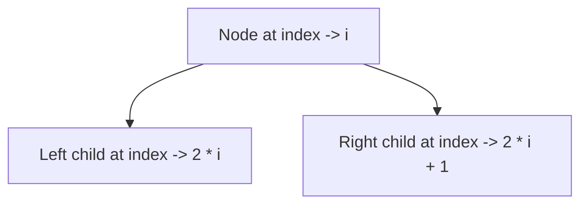

# 🚀 Heaps

- Heap should be a complete binary tree.
- Every node must be greater than or equal to its children.
- Not used for searching
- Since height of a complete binary tree is always `log(n)`, height of heap is also `log(n)`
- Implemented using arrays
- Indexing starts from 1 instead of 0 to calculate the child nodes easily




## 🚀 Steps to insert elements into a max heap

- Insert the element at next free space
- Move the element up until parent is smaller than the element getting inserted
- Time complexity will be `log(n)` since the max number of swaps will be equal to height of heap

## 🚀 Steps to remove elements from a max heap

- We can only delete the max element from heap
- Bring the last element of the heap to the first place
- Compare with child nodes and swap with larger child.
- Time complexity will be `log(n)` since the max number of swaps will be equal to height of heap

## 🚀 Steps to get the max element

- Return the first element of the heap
- Time complexity will be `O(1)`

## 🚀 Heap sort

- If we remove elements from top and store them at the end of array, we will get a sorted array
- This is called heap sort.
- Since removing 1 element take `log(n)`  time, removing `n`elements will take `n log(n)` time.

## Code


```java
public class MaxHeap {
    private int[] elements;
    private int capacity;
    private int size; // maintains 1 based indexing for easier calculation of child & parent

    public MaxHeap(int capacity) {
        this.capacity = capacity;
        this.elements = new int[capacity + 1];
        this.size = 0;
    }

    public boolean isEmpty() {
        return size == 0;

    }

    public int getSize() {
        return size;
    }

    private void doubleCapacity() {
        int[] tempArr = new int[capacity * 2];
        System.arraycopy(elements, 0, tempArr, 0, elements.length);
        elements = tempArr;
        capacity = capacity * 2;
    }

    private int getParentIndex(int index) {
        return index / 2;
    }

    private int getLeftChildIndex(int index) {
        return index * 2;
    }

    private int getRightChildIndex(int index) {
        return index * 2 + 1;
    }

    private void swapElement(int x, int y) {
        int temp = elements[x];
        elements[x] = elements[y];
        elements[y] = temp;
    }

    public void push(int value) {
        if (size >= capacity) doubleCapacity();

        // Step 1: Add the new element at last
        elements[size++] = value;

        // Step 2: Swap with parent until parent is smaller
        while (elements[size] > elements[getParentIndex(size)]) {
            swapElement(size, getParentIndex(size));
        }
    }

    public int peek() {
        return elements[0];
    }

    // We can only remove root node in a heap
    public int pop() {
        int value = peek();

        // Step 1: Swap last element with the first element
        swapElement(0, size);
        size--;

        // Step 2: Swap with larger child (for max heap)
        int i = 0;
        while ((getLeftChildIndex(i) < capacity && elements[getLeftChildIndex(i)] > elements[i]) ||
                (getRightChildIndex(i) < capacity && elements[getRightChildIndex(i)] > elements[i])) {
            int greaterChildIndex;
            if (elements[getLeftChildIndex(i)] > elements[getRightChildIndex(i)]) {
                greaterChildIndex = getLeftChildIndex(i);
            } else {
                greaterChildIndex = getRightChildIndex(i);
            }
            swapElement(i, greaterChildIndex);
            i = greaterChildIndex;
        }
        return value;
    }
}
```

