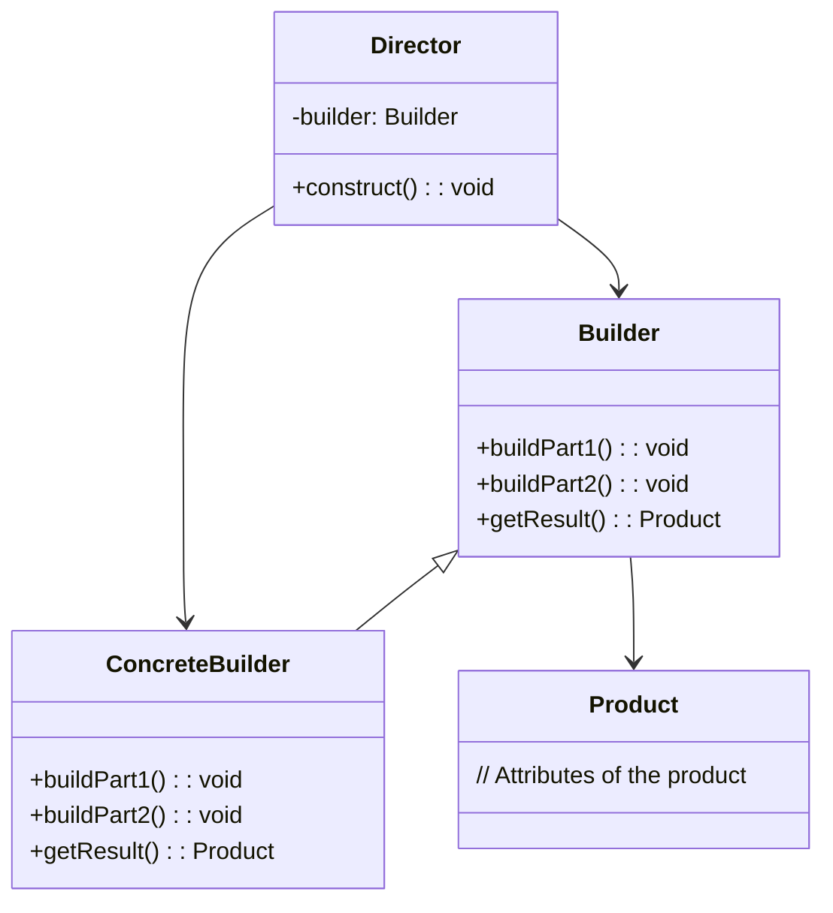

# 🚀 Builder Pattern

### Purpose

- The Builder Pattern is a creational design pattern used to construct complex objects step by step. It separates the construction of a complex object from its representation so that the same construction process can create different representations. This pattern is particularly useful when the object being created has multiple optional or required components, and you want to avoid a large number of constructors or factory methods.

### Use when

- When creating an object involves many steps or configurations.
- To create immutable objects with optional parameters.
- To construct different representations of an object with the same construction process.
- The addition of new creation functionality without changing
the core code is necessary.
- Runtime control over the creation process is required.

### Example

A file transfer application could possibly use many different protocols to send files and the actual transfer object that will be created will be directly dependent on the chosen protocol. Using a builder, we can determine the right builder to use to instantiate the right object. If the setting is FTP, then the FTP builder would be used when creating the object.

