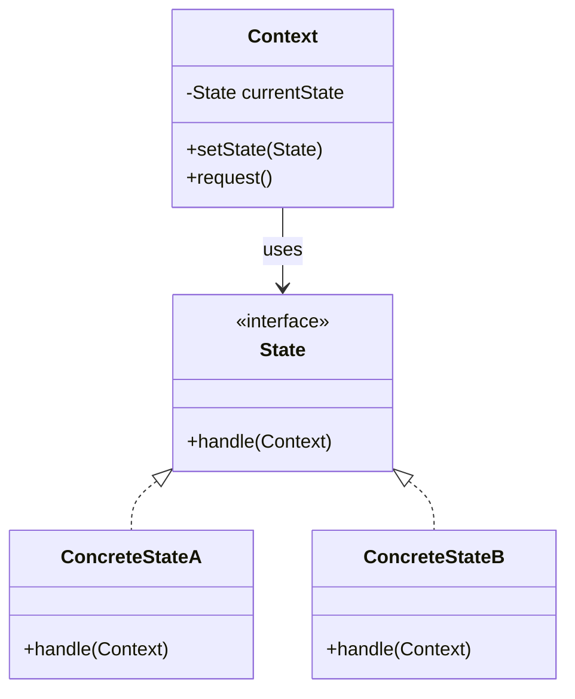

# 🚀 State Pattern

### Purpose

- Ties object circumstances to its behavior, allowing the object to behave in different ways based upon its internal state.

### Use when

- The behavior of an object should be influenced by its state.
- Complex conditions tie object behavior to its state.
- Transitions between states need to be explicit.

### Example

An email object can have various states, all of which will change how the object handles different functions. If the state is “not sent” then the call to send() is going to send the message while a call to recallMessage() will either throw an error or do nothing. However, if the state is “sent” then the call to send() would either throw an error or do nothing while the call to recallMessage() would attempt to send a recall notification to recipients. To avoid conditional statements in most or all methods there would be multiple state objects that handle the implementation with respect to their particular state. The calls within the Email object would then be delegated down to the appropriate state object for handling

