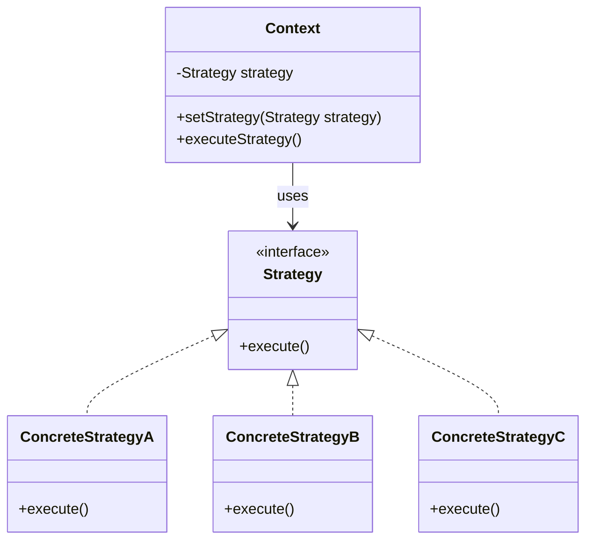

# 🚀 Strategy Pattern

### Purpose

- Strategy is a behavioral design pattern that lets you define a family of algorithms, put each of them into a separate class, and make their objects interchangeable.

### Use when

- When you have multiple algorithms for a specific task, and you want to choose the algorithm at runtime.
- When you want to avoid using conditional statements (like if-else or switch-case) to select the appropriate algorithm.
- When you have a class that performs various functions that might change in the future.
- Algorithms access or utilize data that calling code shouldn’t be exposed to client.

### Example

- **Sorting Algorithms**: You might have different sorting strategies like bubble sort, merge sort, or quicksort, and you can choose the appropriate sorting strategy based on the context.
- **Compression Algorithms**: A file compression program might use different compression algorithms like ZIP, RAR, or TAR, chosen dynamically at runtime.
