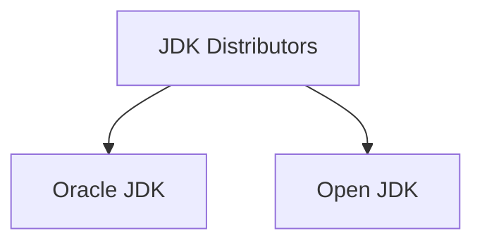
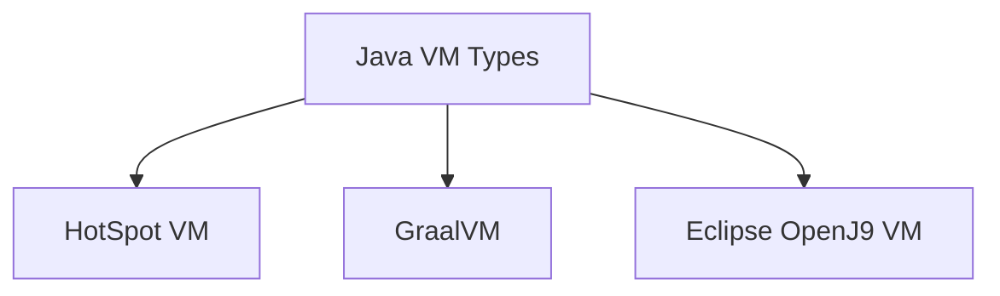
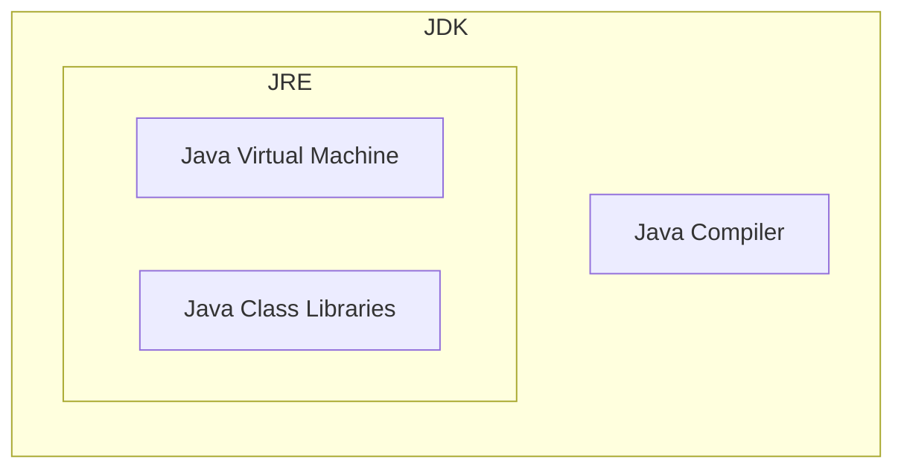
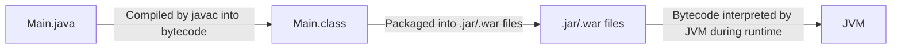
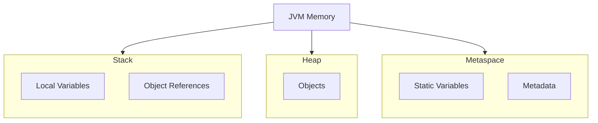

# 🚀 Java Internals


# ♨️ Java Components


### Java Development Kit




- Oracle JDK comes with some libraries pre-installed whereas Open JDK is more lightweight

### Java Virtual Machines




- JRE consists of JVM, Java binaries, and other classes to execute any program successfully

### JDK vs JRE




- We can use JRE to deploy a java application, but we need JDK for development purpose because JRE doesn’t have compiler

# ♨️ How code runs





> 💡 Benefits of converting to bytecode is that we can write code once and can be run anywhere (Linux, Windows, Mac, 64bit, 32bit)

- JVM has complex algorithms like **JIT** (Just in time compilation) to make the interpretation faster.

# ♨️ JIT Compilation

- JIT Compilation is an algorithm used by JVM, which checks the more frequently used code and converts it to machine code.
- As JIT compilation occurs over time by identifying frequently executed code, the longer a program runs, the more code JIT converts to native code, resulting in faster execution.
- Since the JVM is multithreaded, the thread performing JIT compilation is separate from the thread interpreting code. This allows code execution to continue uninterrupted during JIT compilation.
- During high-processing tasks that fully utilize all CPU cores, we might observe a slight performance dip when JIT compilation occurs. However, subsequent runs of the same code will be faster, making this tradeoff beneficial overall.
- To see which part of our code is getting JIT compiled we can use a flag `-XX:+Print Compilation` .

    ```mermaid
    graph TD
        JVM[JVM] --> C1[Client Compiler C1]
        JVM --> C2[Server Compiler C2]
        
        C1 --> N1[Native Level 1]
        C1 --> N2[Native Level 2]
        C1 --> N3[Native Level 3]
        
        C2 --> N4[Native Level 4]
        
        N4 --> Cache[Code Cache]
    ```

- The JVM determines the appropriate level of compilation to apply during JIT for a specific block of code. This decision is based on two factors: how frequently the code runs and how complex or time-consuming it is to compile. This is called **code profiling**.
- For very frequently used code, the step beyond native level 4 is storing that code block in the code cache. This cache offers faster access, further speeding up execution.
- If code cache gets full, we will receive a warning in console `VM Warning: Code cache is full. Compiler is disabled.` . We can increase the code cache if this happens to prevent degradation in performance.

> 💡 JVM only optimizes frequently used code due to the tradeoff between compilation time and execution speed.


> 💡 For short-running programs, the client compiler is preferable as it provides faster startup times. While we can use the `--client` flag to exclusively use the client compiler, this is rarely necessary since the JVM is sophisticated enough to make this decision on its own.


### 32bit vs 64bit Java Virtual Machine


|                                                                **32bit JVM** |                                                                **64bit JVM** |
| ---------------------------------------------------------------------------- | ---------------------------------------------------------------------------- |
| Has only client compiler                                                     | Has both client and server compiler                                          |
| Max heap size is 4GB                                                         | Necessary if heap size > 4GB                                                 |
| Might be faster if heap < 3GB                                                | Faster if using long / double                                                |


# ♨️ Memory management





## Stack

- Local variables are created on the stack. For objects, the stack holds variables containing memory references to the object.
- Memory management for stack variables is straightforward. When a block that created a variable finishes executing, local variables are automatically removed from the stack.
- Each thread maintains its own stack.
- In Java, variables are always passed by value to method calls. This means that for each method call, new copies of the variables are created on the stack.
- However, when a variable references an object, it only stores the memory address of that object in the heap. Thus, we create a copy of the memory reference, not the object itself. This behavior is often referred to as "pass by reference" for objects, though technically it's still pass by value of the reference.

### Heap

- Objects are stored in heap.
- Single heap is shared across threads.
- If we stored objects on the stack, each method call would require creating a copy of the object, as the stack can't access variables buried deeper. This approach would be inefficient. Therefore, we store objects on the heap.
- Objects that no longer have references from the stack are removed during garbage collection.

### Meta Space

- This stores metadata about classes, methods etc.
- Meta space is also used to store static variables. It is like a stack for static variables.
- Static objects are created in heap, but their reference is stores in meta space.
- Since static objects are never out of scope, there is no garbage collection for the objects referenced from meta space.
- All the threads and classes have access to meta space so static variables / methods can be accessed from anywhere.

# ♨️ Garbage collection

